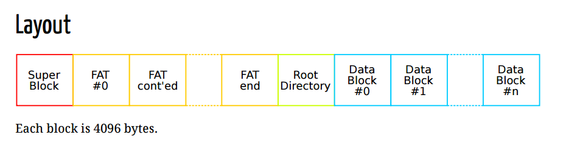

# PSOP-Simply-Filesystem-
Simple File System Project
Motivație:
	Scopul acestui proiect este de a ne ajuta sa intelegem mai bine  notiunile de la baza unui Linux FS. Linux FS suporta multiple sisteme de fisiere(ext2,ext3,ext4,NTFS,etc.). File System-ul pe care urmeaza sa il implementam este bazat pe FAT care sa suporte pana la 128 de fisiere in directorul root. Layout-ul unui File System pe disc este compus din 4 parti logice consecutive si sunt dispuse in urmatoarea ordine: Superblock, FAT, Directorul Root si Blocurile Data.
	TODO: O diagramă cu cum e imaginea pe disk a FS-ului

	
Funcționzalități:

1.	Mount/Un-mount: sistemul de fisiere continut pe discul virtual specificat trebuie sa fie gata pentru a fi folosit. Adica toate componentele acestuia trebuie sa fie initializate sau copiate de pe alt disc virtual cu toate informatiile necesare. Pentru a face asta, blocul API trebuie sa fie gata sa citeasca fiecare bloc in memoria noastra. 
2.	Crearea Fisierelor/Stergerea fisierelor: Permite utilizatorului sa creeze sau sa stearga din fisiere. Pentru a crea un nou fisier, programul va cauta un spatiu liber in directorul root prin verificarea primului byte al unei posibile intrari(daca este 0 atunci vom initializa intrarea cu numele fisierului primit ca argument). Pentru stergerea unui fisier programul se va asigura ca intrarea fisierului este goala si ca tot continutul blocurilor de date detinute de fisier au fost eliberate in FAT.
3.	Operatii cu File Descriptor: FDT este important in gestionarea operatiilor de deschidere si inchidere ale fisierelor. 
4.	Citirea/Scrierea in fisier: Aceste doua functionatilati sunt cele mai complexe si vor permite citirea/scrierea unui fisier de pe disc.

Arhitectura:
- elemente componente
- module
- Structuri de date folosite

Testare/Mod de utilizare (TODO 1)
- Interactiunea cu FS se va face prin intermediul unei aplicații
- ./app <partitie> <comanda> <parametri>
- ./app /dev/sdb1 ls /

Interactiune de tip bibliotecă
- ref = myfat_init("/dev/sdb/1);"
- int fd = myfat_open("/dev/sda", "r");
- myfat_read(fd, buffer, ...);

 
