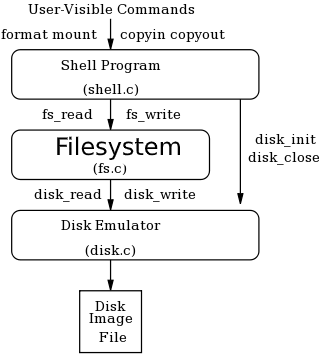
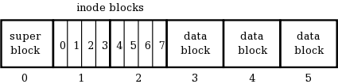
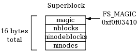
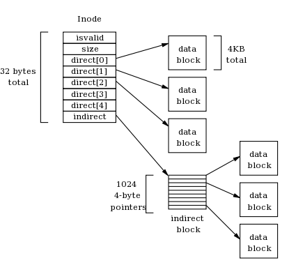

# PSOP-Simply-Filesystem-
Simple File System Project
Motivație:
	Scopul acestui proiect este de a ne ajuta sa intelegem mai bine  notiunile de la baza unui Linux FS. File System-ul pe care urmeaza sa il implementam este bazat mai mult Unix Inode Layer. SimplyFS are 3 componente majore: shell-ul, filesystem-ul si emulated disk-ul. Noi ne vom ocupa in principiu de filesystem.

In shell userul va introduce comenzile puse la dispozitie de SimpleFS, care vor fi convertite ulterior de catre aplicatia noastra, avand in spate diverse functii care vor fi descrise mai jos. 
Disk Emulator are toate caracteristicile unui disk real: incarca si stocheaza datele in blocuri, genereaza erori si poate da crash.

Fiecare bloc de disc este de 4KB. Primul bloc este SuperBlock-ul, urmat de un numar de blocuri Inode, iar mai apoi Data Block.

<b>Superblock</b>: Este primul bloc de pe disk si contine meta-date esentiale despre file system cum ar fi semnatura discului(magic number-ul), numarul de blocuri pe care il contine, numarul de blocuri care vor stoca inode-urile si numarul total de inoduri. Fiecare camp are 4 bytes.

<b>iNode</b>:La fel ca la superblock, fiecare camp are 4 bytes. Isvalid este setat pe unu in cazul in care Inode-ul respectiv este valid, si pe 0 in caz contrar. Size reprezinta dimensiunea logica pe care o ocupa Inodul(in bytes). Tot in aceasta structura vom avea 5 direct pointer si un indirect pointer catre Data Blocks(reprezinta de fapt numarul blocului unde pot fi gasite datele). Fiecare iNode ocupa 32 de bytes, deci un iNode Block poate sa contina maxim 128 de inode-uri. Indirect data block este doar un vector de pointeri directi catre alte blocuri data.

De asemenea vom mai avea nevoie de un bitmap care va avea valoarea 0 sau 1 daca blockul/inodul este disponibil sau nu. El va fi consultat si actualizat de fiecare data cand FS doreste sa adauge sau sa stearga  un datablock din inode.

Funcționalități:

1. <b><i>Disk_init/disk_close:</b></i> Inainte de a face orice operatie pe disk, trebuie sa initiem discul. De asta se va ocupa functia disk_init, careia va trebui sa ii specificam numele discului si numarul de blocuri. In momentul in care am terminat cu discul respectiv, va fi apelata functia disk_close.
2. <b><i>Disk_size:</b></i> Odata ce discul a fost initializat, vom avea nevoie de o functie care sa ne intoarca numarul de blocuri de pe disk. Functiile disk_read(block_number,data) si disk_write() citest si scriu un bloc de date pe disc. In momentul in care dorim sa citim sau sa scriem un disk block care nu exista vom genera un mesaj de eroare.
3. <b><i>Fs_Debug:</b></i> Scaneaza un mounted filesystem si va afisa diverse detalii:
-Daca magic number este sau nu valid;
-Numarul de blocuri de pe disk;
-Numarul de blocuri  inodes;
-Numarul total de inoduri;

4. <b><i>Fs_mount:</b></i> Va examina discul pentru filesystem. Daca este deja prezent un FS, va citi superblockul, va genera un free block bitmap si va prepara FS pentru a putea fi folosit. Return 1=>succes! 0=>Fail! Mount-ul unui disk este esential pentru ca celelalte functionalitati sa poate fi folosite.
5. <b><i>Fs_create:</b></i> Va crea un nou inode de lungime 0. Return inode_nr=>succes! Negative_nr=>Fail!
6. <b><i>Fs_delete:</b></i> Sterge inode-ul dat ca argument. Elibereaza toate datele si indirect blocurile aisgnate acelui inode. Return 1=>succes! 0=>Fail!
7. <b><i>Fs_write</b></i> Functie care permite scrierea de date intr-un fisier specificat prin numarul de inode. Aceasta citeste datele din memorie si le scrie in blocurile de disc specificate de inodul fisierului.  Functia verifica daca exista suficient spatiu pentru a scrie datele si, daca este necesar, aloca si seteaza noi blocuri pentru a stoca datele. De asemenea, functia memoreaza datele in blocurile de date si actualizeaza informatiile despre dimensiunea inode-uli si blocurile utilizate in inode.
8. <b><i>Fs_read</b></i> Funcția utilizată pentru a citi date dintr-un anumit inode din FS. Funcția va citi datele din fișier și le va copia în buffer-ul specificat, returnând numărul de octeți cititi. Dacă datele depășesc dimensiunea fișierului, funcția va returna numărul de octeți cititi.
   